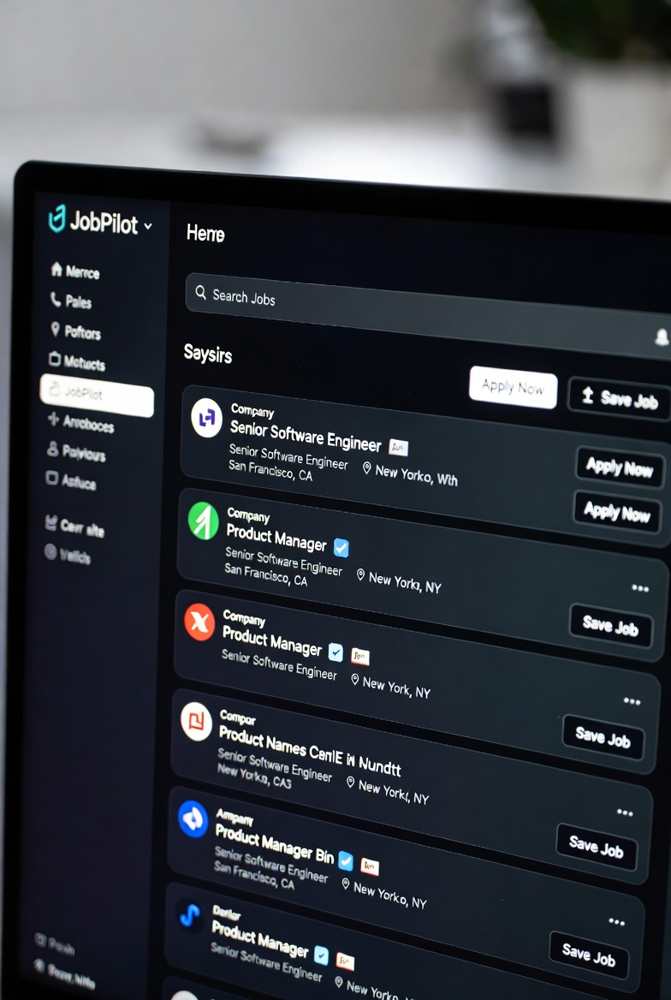

<div align="center">


# JobPilot ✈️


[](https://nextjs.org/)
[](https://fastapi.tiangolo.com/)
[](https://github.com/model-context-protocol)
[](LICENSE)

**キャリア成功のためのインテリジェントAIエージェント**
*求人検索、履歴書最適化、応募管理の自動化*

[機能](#-機能) • [アーキテクチャ](#-アーキテクチャ) • [始め方](#-始め方) • [ロードマップ](#-ロードマップ)

[English](README.md) | [中文](README_CN.md) | [日本語](README_JP.md) | [한국어](README_KR.md) | [Français](README_FR.md) | [Deutsch](README_DE.md)

</div>

---

## 📖 はじめに

**JobPilot**は、**AIエージェント**と**Model Context Protocol (MCP)**を搭載した次世代キャリアアシスタントです。あなたの個人的なリクルーターとして機能し、LinkedInなどのプラットフォームで求人を絶え間なく検索し、特定の職務記述書（JD）に合わせて履歴書を最適化し、応募プロセスさえも自動化します。

AI時代のために設計されたJobPilotは、完全なMCPサーバーを公開しており、お気に入りのAIアシスタント（Claude Desktop、OpenClaw、カスタムエージェントなど）と接続して、就職活動を自律的に処理できます。

> **なぜJobPilotなのか？**
> 応募ごとに履歴書を手動で調整する代わりに、JobPilotのエージェントにJDを分析させ、関連するスキルを強調するために履歴書を書き換えさせ、あなたが寝ている間に応募を提出させましょう。

<a href="https://glama.ai/mcp/servers/arthurpanhku/job-pilot">
  
</a>



<video src="assets/grok-video-demo.mp4" controls="controls" style="max-width: 100%;">
</video>

## ✨ 機能

### 🤖 MCPネイティブアーキテクチャ
- **エージェントファースト設計**: Model Context Protocol (MCP) サーバーとしてゼロから構築されています。
- **ユニバーサル互換性**: MCP準拠のクライアント（Claude、IDE、エージェントフレームワーク）とシームレスに接続します。

### 📄 インテリジェント履歴書エンジン
- **コンテキスト認識最適化**: マスタープロフィールをターゲットJDと照合分析し、超パーソナライズされた履歴書を生成します。
- **ATS対応**: 生成された履歴書が採用追跡システム（ATS）向けに最適化されていることを保証します。

### 🕵️ 自動求人ハンター
- **スマート検索**: セマンティックプロフィールに基づいて、LinkedInやIndeedから求人情報をスクレイピングしてフィルタリングします。
- **自動応募**: ステルスモードと検知回避メカニズム（人間らしい遅延、ランダムなユーザーエージェント）を組み込んだ自動フォーム入力。
- **リスク軽減**: アカウントのフラグ付けを回避するための、ドライラン機能と手動確認ステップを備えた「セーフモード」。

### 📊 応募追跡
- **ダッシュボード**: Shadcnコンポーネントで構築されたモダンなUIで、応募状況、面接パイプライン、成功率を可視化します。
- **履歴**: リクルーターに送信されたすべてのカスタマイズされた履歴書バージョンの記録を保持します。

## 🛠️ 技術スタック

- **フロントエンド**: 
  - [Next.js 14](https://nextjs.org/) (App Router)
  - TypeScript
  - Tailwind CSS & Lucide Icons
- **バックエンド**: 
  - [FastAPI](https://fastapi.tiangolo.com/) (Python)
  - Pydantic
  - MCP SDK (Python)
- **自動化 & AI**:
  - Playwright (ブラウザ自動化)
  - OpenAI / Anthropic APIs (LLM)
  - Supabase (データベース & 認証)

## 🚀 始め方

### 前提条件
- Node.js 18+
- Python 3.11+
- Git

### インストール

1. **リポジトリをクローン**
   ```bash
   git clone https://github.com/yourusername/job-pilot.git
   cd job-pilot
   ```

2. **バックエンドセットアップ**
   ```bash
   cd backend
   python -m venv venv
   source venv/bin/activate  # Windowsの場合: venv\Scripts\activate
   pip install -r requirements.txt
   
   # API & MCPサーバーを起動
   python app/main.py
   ```

3. **フロントエンドセットアップ**
   ```bash
   cd frontend
   npm install
   
   # UIを起動
   npm run dev
   ```

4. **アプリにアクセス**
   - フロントエンド: `http://localhost:3000`
   - APIドキュメント: `http://localhost:8000/docs`

## 🗺️ ロードマップ

- [x] プロジェクト初期化 & アーキテクチャ設計
- [ ] **フェーズ 1**: MCPサーバー実装 & 基本プロフィール管理
- [ ] **フェーズ 2**: LinkedInスクレイパー統合 & 求人マッチング
- [ ] **フェーズ 3**: 履歴書最適化パイプライン (LLM)
- [ ] **フェーズ 4**: OpenClaw/Playwrightによる自動応募

## 🤝 貢献

貢献は大歓迎です！お気軽にPull Requestを送信してください。

## 🌟 Star History

[](https://star-history.com/#arthurpanhku/job-pilot&Date)

## 📄 ライセンス

このプロジェクトはMITライセンスの下でライセンスされています - 詳細は[LICENSE](LICENSE)ファイルを参照してください。
